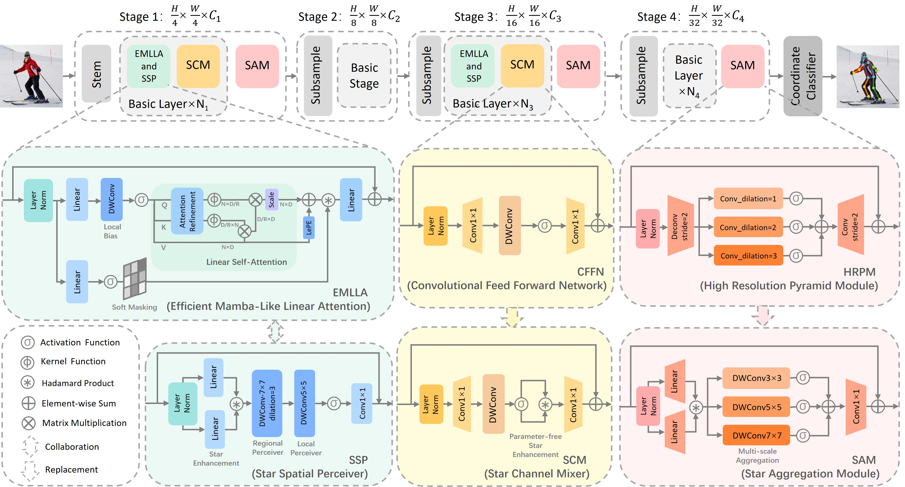

# StarPose
StarPose: Bridging Performance and Efficiency in Lightweight Pose Estimation via Star Reconstruction
## News
2025/06/01 The paper has been accepted as a short paper at KSEM 2025
## Abstract

Lightweight methods for human pose estimation continue to pose a significant research challenge. While many existing methods adopt the high-resolution design pattern of HRNet and subsequently apply lightweight modifications, the multi-resolution branching paradigm inherently limits model throughput. To overcome this limitation, we propose StarPose, a novel single-branch, upsampling-free hierarchical Vision Transformer architecture. Building upon the HRPVT framework, StarPose introduces optimized micro-block designs for enhanced efficiency and reconstructs the network utilizing an advanced star operation. This innovative design enables StarPose to process high-dimensional feature representations within a low-dimensional computational space, thereby facilitating more effective semantic encoding and surpassing the performance limitations of HRPVT. To further alleviate the redundancy caused by the homogeneous stacking of self-attention layers in StarPose, this paper also introduces a redundancy-reduced joint regional-global encoding stage, which improves computational efficiency while enhancing overall performance. Under nearly the same model complexity, the proposed method achieves faster inference speed than Lite-HRNet across various platforms, while maintaining superior accuracy on both the MS COCO, CrowdPose and MPII benchmarks. These advancements significantly enhance the feasibility of deployment on resource-constrained edge devices.



## Results and models

The pre-trained model weights are available at the provided link [GoogleDrive](https://drive.google.com/drive/folders/1htanycLFR_9U-eiZTKsvN58UC9LIrPxR?usp=sharing)

## Prepare datasets

It is recommended to Symlink the dataset root to `$StarPose/data`.
If your folder structure is different, you may need to change the corresponding paths in config files.

**For COCO dataset**, please download from [COCO download](http://cocodataset.org/#download), 2017 Train/Val is needed for COCO keypoints training and validation. [HRNet-Human-Pose-Estimation](https://github.com/HRNet/HRNet-Human-Pose-Estimation) provides person detection result of COCO val2017 to reproduce our multi-person pose estimation results. Please download from [OneDrive](https://1drv.ms/f/s!AhIXJn_J-blWzzDXoz5BeFl8sWM-)
Download and extract them under `$StarPose/data`, and make them look like this:

```
StarPose
├── configs
├── tools
`── data
    │── coco
        │-- annotations
        │   │-- person_keypoints_train2017.json
        │   |-- person_keypoints_val2017.json
        |-- person_detection_results
        |   |-- COCO_val2017_detections_AP_H_56_person.json
        │-- train2017
        │   │-- 000000000009.jpg
        │   │-- 000000000025.jpg
        │   │-- 000000000030.jpg
        │   │-- ...
        `-- val2017
            │-- 000000000139.jpg
            │-- 000000000285.jpg
            │-- 000000000632.jpg
            │-- ...

```

**For MPII dataset**, please download from [MPII Human Pose Dataset](http://human-pose.mpi-inf.mpg.de/).
We have converted the original annotation files into json format, please download them from [mpii_annotations](https://openmmlab.oss-cn-hangzhou.aliyuncs.com/mmpose/datasets/mpii_annotations.tar).
Extract them under `$StarPose/data`, and make them look like this:

```
StarPose
├── configs
├── tools
`── data
    │── mpii
        |── annotations
        |   |── mpii_gt_val.mat
        |   |── mpii_test.json
        |   |── mpii_train.json
        |   |── mpii_trainval.json
        |   `── mpii_val.json
        `── images
            |── 000001163.jpg
            |── 000003072.jpg

```

**For CrowdPose dataset**, please download from [CrowdPose](https://github.com/Jeff-sjtu/CrowdPose).
Please download the annotation files and human detection results from [crowdpose_annotations](https://download.openmmlab.com/mmpose/datasets/crowdpose_annotations.tar).
For top-down approaches, we follow [CrowdPose](https://arxiv.org/abs/1812.00324) to use the [pre-trained weights](https://pjreddie.com/media/files/yolov3.weights) of [YOLOv3](https://github.com/eriklindernoren/PyTorch-YOLOv3) to generate the detected human bounding boxes.
For model training, we follow [HigherHRNet](https://github.com/HRNet/HigherHRNet-Human-Pose-Estimation) to train models on CrowdPose train/val dataset, and evaluate models on CrowdPose test dataset.
Download and extract them under $StarPose/data, and make them look like this:

```text
$StarPose
├── configs
├── tools
`── data
    │── crowdpose
        │-- annotations
        │   │-- mmpose_crowdpose_train.json
        │   │-- mmpose_crowdpose_val.json
        │   │-- mmpose_crowdpose_trainval.json
        │   │-- mmpose_crowdpose_test.json
        │   │-- det_for_crowd_test_0.1_0.5.json
        │-- images
            │-- 100000.jpg
            │-- 100001.jpg
            │-- 100002.jpg
            │-- ...

```

# Acknowledgement:
This project is developed based on the [MMPOSE](https://github.com/open-mmlab/mmpose). Please follow the official documentation for environment setup.


